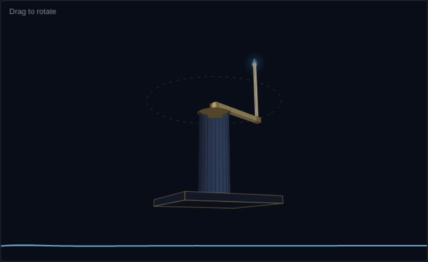
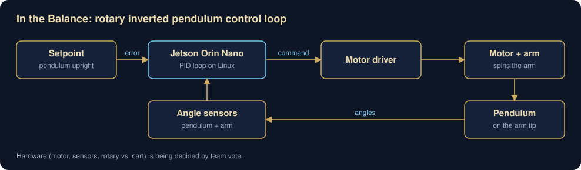

# In the Balance: Rotary Inverted Pendulum

A rotary inverted pendulum (Furuta pendulum) the IEEE EXO controls team is building as practice before we work on the exoskeleton. A motor spins an arm, a pendulum stands on the arm's tip, and the controller has to keep it upright.

**Status:** planning. The team is voting on hardware choices before we research, buy, and build.

**[Try the 3D simulation](https://oscarc727.github.io/rotary-inverted-pendulum/sim/)**: swing it up, let the PID catch it, then change the gains and see what happens.



## Why we're building it

The exoskeleton is an unstable system with a person inside it. The pendulum is the same problem on a desk, so it's cheap to break and safe to crash. It uses the same loop as the exo's joints (sense, compute, actuate at a fixed rate) and the same computer, a Jetson Orin Nano running Linux.



## Plan

1. **Simulate.** Model the pendulum in Python and tune PID there first.
2. **Build and sense.** Assemble the hardware and stream angles into the Jetson.
3. **First balance.** Hold it upright from a hand start.
4. **Push test.** Recover from a push, with the tuning documented.
5. **Stretch.** Swing-up from hanging, and PID vs. LQR on the same rig.

## How we work

- MATLAB and Simulink first, real hardware after.
- All code runs on Linux on the Jetson, so everyone gets comfortable with SSH, Git, and the terminal before we touch the exo.
- I also run PID workshops for the team alongside the build.

## Repo layout

```
sim/     browser simulation (the 3D demo above)
docs/    diagrams
media/   screenshots, and build photos once we have them
```
